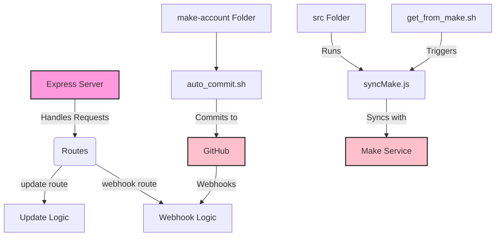

# cnc-node

I'M read em I'll tell you how to iunstall me... 

```mermaid
graph TD

    A[Express Server] -->|Handles Requests| B(Routes)
    B -->|update route| C[Update Logic]
    B -->|webhook route| D[Webhook Logic]

    E[GitHub] -->|Webhooks| D
    F[make-account Folder] --> G[auto_commit.sh]
    G -->|Commits to| E[GitHub]
    
    H[src Folder] -->|Runs| I[syncMake.js]
    I -->|Syncs with| J[Make Service]
    K[get_from_make.sh] -->|Triggers| I

    style A fill:#f9d,stroke:#333,stroke-width:2px
    style E fill:#ffc0cb,stroke:#333,stroke-width:2px
    style J fill:#ffc0cb,stroke:#333,stroke-width:2px
```